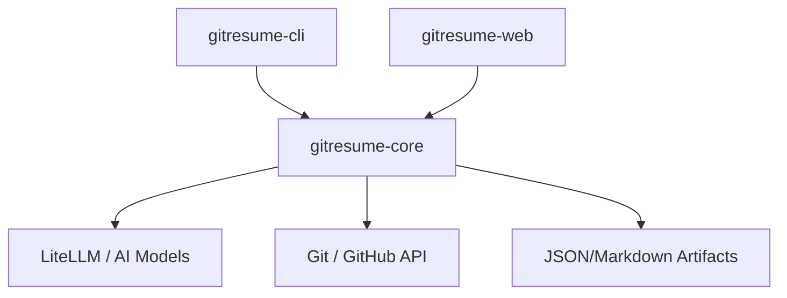

# Project Status: GitResume v0.0.2

## Project Overview
**GitResume v0.0.2 - Migration Complete**

GitResume is a powerful tool designed to generate professional, high-quality resumes directly from your GitHub repositories. By analyzing your codebase using tree-sitter for structural understanding and LiteLLM for intelligent summarization, it transforms your raw code into a compelling narrative of your technical expertise.

## Architecture
The project follows a modular 3-tier structure:

- **`gitresume-cli`**: Typer-powered command-line interface providing a developer-friendly entry point.
- **`gitresume-core`**: The engine of the project, handling repository ingestion, structural code analysis, LLM orchestration, and artifact management.
- **`gitresume-web`**: A FastAPI-based web interface for interactive resume generation and previewing.

## Key Features
- **CLI-First**: Optimized for terminal workflows and CI/CD pipelines.
- **Artifact-Driven**: Generates intermediate JSON artifacts, allowing for easy manual overrides and persistent resume data.
- **LiteLLM Integration**: Unified access to multiple AI providers (OpenAI, Anthropic, Gemini, etc.) with automatic retries and caching.
- **Cross-Platform Binaries**: Distributed as standalone executables for Windows, macOS, and Linux using PyInstaller.
- **Structural Analysis**: Uses `tree-sitter` to deeply understand codebases across multiple languages (Python, JS, Go, Rust, etc.).

## Infrastructure
- **Dependency Management**: Powered by `uv` for lightning-fast installs and reproducible environments.
- **CI/CD**: GitHub Actions workflows for automated testing and cross-platform binary builds.
- **Containerization**: Full Docker support for consistent deployment and local testing.
- **Quality Assurance**: Integrated `ruff` for linting and `pytest` for comprehensive unit and integration testing.

## Release History
- **v0.0.1**: Initial migration from legacy monolithic structure to modular architecture.
- **v0.0.2**: Improved binary distribution; fixed archive handling in build scripts and enhanced artifact persistence.

## Next Steps
- [ ] **PyPI Deployment**: Configure GitHub Actions to use Trusted Publishing for automated PyPI releases.
- [ ] **Template Expansion**: Add more professional LaTeX and HTML/CSS resume templates.
- [ ] **Interactive CLI**: Add a wizard mode for the CLI to guide new users through configuration.
- [ ] **Enhanced Filtering**: Improve logic for ignoring boilerplate and non-essential files during ingestion.
